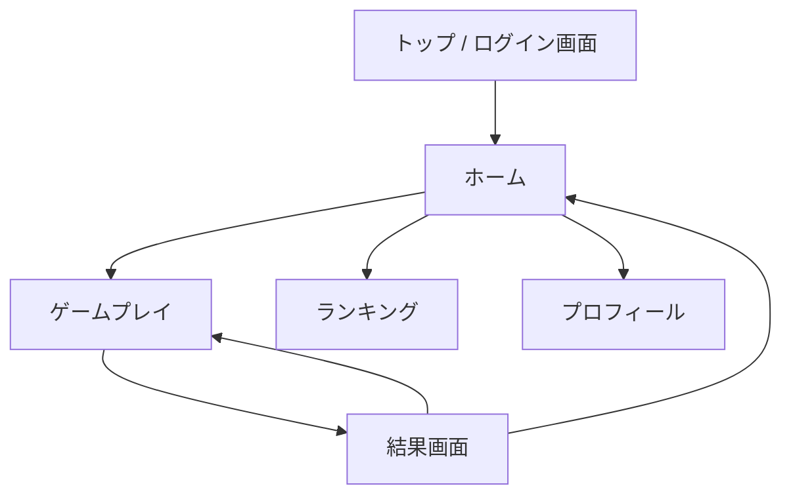

# PeakGuesser — 山の名前当てWebアプリ

写真を見て山の名前を当てるクイズゲーム。硬派でAIっぽくないデザイン、Firebase連携によるログイン・ランキング・プロフィール機能を実装する。

## 技術スタック

| 項目 | 技術 |
|:---|:---|
| フレームワーク | Vite + React 18 + TypeScript |
| ルーティング | react-router v7 |
| 認証/DB | Firebase Auth + Firestore |
| スタイリング | Vanilla CSS（CSS Custom Properties） |
| フォント | Google Fonts — **Noto Sans JP**（本文）+ **Oswald**（見出し・数字） |
| デプロイ | Vercel（GitHub連携） |

## デザインコンセプト — 「硬派・地図・岳」

> [!IMPORTANT]
> AIっぽくない = グラデーション・ネオン・丸角ボタンを排除。代わりに **直線・モノトーン・地形図テクスチャ** を基調とした硬派な世界観。

- **カラーパレット**: ダークスレート `#1a1a2e` / アイボリー `#f0ece2` / アクセント朱色 `#c84b31` / 岩灰 `#4a4a4a`
- **テクスチャ**: 等高線パターンをCSSで背景に配置（SVG）
- **アニメーション**: 最小限。ページ遷移のフェード程度。過剰な動きは排除
- **UI要素**: 角張ったボタン、太い罫線、シンプルなアイコン
- **写真表示**: 枠なし全幅表示。写真の迫力を最大化

## 画面構成



### 1. トップ / ログイン画面 (`/`)
- ロゴ + キービジュアル（山の写真）
- Googleログイン / メール+パスワードログイン
- ゲスト利用ボタン（ログインせずプレイ可能、ランキング登録不可）

### 2. ホーム (`/home`)
- ゲーム開始ボタン
- 直近の成績サマリ
- ナビゲーション（ランキング / プロフィール）

### 3. ゲームプレイ (`/play`)
- 10問出題（日本百名山からランダム）
- 写真を大きく表示
- 4択の選択肢ボタン
- 制限時間バー（1問15秒）
- 正解/不正解のフィードバック（山名 + 標高 + 所在地の豆知識表示）
- 問題番号インジケータ

### 4. 結果画面 (`/result`)
- スコア表示（正答数 / 10）
- 所要時間
- 各問題の振り返り（サムネイル + 正誤）
- ランキング登録（ログイン済みユーザーのみ）
- リトライ / ホームに戻る

### 5. ランキング (`/ranking`)
- 全体ランキング（スコア降順 → タイム昇順）
- 自分の順位ハイライト
- トップ50表示

### 6. プロフィール (`/profile`)
- ユーザー名（編集可能）
- プレイ回数 / 平均スコア / 最高スコア
- 正解した山のコレクション（グリッド表示）
- ログアウトボタン

## User Review Required

> [!IMPORTANT]
> **Firebase プロジェクトの準備が必要です**
> 以下を事前にセットアップしてください：
> 1. [Firebase Console](https://console.firebase.google.com/) で新規プロジェクト作成
> 2. **Authentication** で「Google」と「メール/パスワード」を有効化
> 3. **Firestore Database** を作成（テストモードで開始可）
> 4. ウェブアプリを登録し、`firebaseConfig` を取得
>
> 取得した設定値は `.env` ファイルに記載していただきます。

> [!WARNING]
> **山の写真について**
> 日本百名山の写真はWikimedia CommonsのフリーライセンスURLをデータに埋め込みます。一部の山で適切な画像が見つからない場合、代替画像やプレースホルダーになる可能性があります。最初はよく知られた20〜30山から開始し、段階的に拡充する方針でよいでしょうか？

## Open Questions

1. **ゲームモード**: 10問固定でよいか？「易しい（有名な山のみ）」「難しい（マイナーな山も含む）」のような難易度選択は必要か？
2. **ゲストプレイ**: ログインなしでもプレイ可能にし、ランキング登録のみログイン必須、という方針でよいか？
3. **Firebase プロジェクト**: 既存のFirebaseプロジェクトがあるか？新規作成するか？

## Proposed Changes

### プロジェクト初期化

#### [NEW] プロジェクトルート
- `npm create vite@latest ./ -- --template react-ts` でViteプロジェクトを作成
- `npm install firebase react-router` で依存関係インストール

---

### Firebase 設定

#### [NEW] [firebase.ts](file:///c:/Users/harut/PG/src/firebase.ts)
- Firebase初期化（Auth, Firestore）
- 環境変数 `VITE_FIREBASE_*` から設定読み込み

#### [NEW] [.env.example](file:///c:/Users/harut/PG/.env.example)
- Firebase設定のテンプレート（実際の値はユーザーが `.env` に記入）

---

### 認証 / コンテキスト

#### [NEW] [AuthContext.tsx](file:///c:/Users/harut/PG/src/contexts/AuthContext.tsx)
- `onAuthStateChanged` で認証状態管理
- ログイン/ログアウト/サインアップ関数をProviderで提供

---

### データ

#### [NEW] [mountains.ts](file:///c:/Users/harut/PG/src/data/mountains.ts)
- 日本百名山のデータ（名前、標高、所在地、ヒント、画像URL）
- 初期版は代表的な30山程度

---

### ページコンポーネント

#### [NEW] [Login.tsx](file:///c:/Users/harut/PG/src/pages/Login.tsx)
- Google / メールパスワード ログインUI

#### [NEW] [Home.tsx](file:///c:/Users/harut/PG/src/pages/Home.tsx)
- ゲーム開始、ナビゲーションハブ

#### [NEW] [Play.tsx](file:///c:/Users/harut/PG/src/pages/Play.tsx)
- ゲームロジック（出題、タイマー、4択、正解判定）

#### [NEW] [Result.tsx](file:///c:/Users/harut/PG/src/pages/Result.tsx)
- スコア表示、振り返り、ランキング登録

#### [NEW] [Ranking.tsx](file:///c:/Users/harut/PG/src/pages/Ranking.tsx)
- Firestoreからランキングデータ取得・表示

#### [NEW] [Profile.tsx](file:///c:/Users/harut/PG/src/pages/Profile.tsx)
- ユーザー統計、正解コレクション

---

### 共通コンポーネント

#### [NEW] [Header.tsx](file:///c:/Users/harut/PG/src/components/Header.tsx)
- ロゴ + ナビゲーション + ユーザーアバター

#### [NEW] [Timer.tsx](file:///c:/Users/harut/PG/src/components/Timer.tsx)
- 制限時間バー（15秒カウントダウン）

#### [NEW] [MountainCard.tsx](file:///c:/Users/harut/PG/src/components/MountainCard.tsx)
- 山情報カード（結果画面・プロフィールで使用）

---

### スタイリング

#### [NEW] [index.css](file:///c:/Users/harut/PG/src/index.css)
- CSS Custom Properties（カラー、タイポグラフィ、スペーシング）
- 等高線テクスチャ背景
- リセット + グローバルスタイル

#### [NEW] 各ページ・コンポーネントのCSSモジュール
- `Login.css`, `Home.css`, `Play.css`, `Result.css`, `Ranking.css`, `Profile.css`
- `Header.css`, `Timer.css`, `MountainCard.css`

---

### ルーティング / エントリポイント

#### [MODIFY] [App.tsx](file:///c:/Users/harut/PG/src/App.tsx)
- React Router v7 によるルート定義
- AuthContextでラップ
- 認証ガード（ランキング・プロフィールはログイン必須）

#### [MODIFY] [main.tsx](file:///c:/Users/harut/PG/src/main.tsx)
- BrowserRouterでラップ

---

### Firestore サービス

#### [NEW] [gameService.ts](file:///c:/Users/harut/PG/src/services/gameService.ts)
- スコア保存 / ランキング取得 / ユーザープロフィール更新
- Firestoreのコレクション設計：
  - `users/{uid}` — プロフィール、統計
  - `scores/{docId}` — 各プレイのスコアレコード

---

### デプロイ設定

#### [NEW] [vercel.json](file:///c:/Users/harut/PG/vercel.json)
- SPAリライト設定（全ルートを `index.html` にリダイレクト）

## Firestore コレクション設計

```
users/
  {uid}/
    displayName: string
    photoURL: string | null
    totalGames: number
    totalCorrect: number
    bestScore: number
    bestTime: number
    collectedMountains: string[]   // 正解した山のIDリスト
    createdAt: timestamp
    updatedAt: timestamp

scores/
  {docId}/
    userId: string
    displayName: string
    score: number            // 正答数 (0-10)
    timeMs: number           // 所要時間（ミリ秒）
    playedAt: timestamp
```

## Verification Plan

### ローカル動作確認
1. `npm run dev` でローカルサーバー起動
2. 各画面の遷移確認
3. Firebase未設定時のフォールバック動作確認（エラーにならずゲストモードで動作）

### Firebase連携確認
- ユーザーが `.env` に設定値を記入後、ログイン/ランキング/プロフィール機能をテスト

### ビルド確認
- `npm run build` でエラーなくビルド完了
- Vercelへのデプロイ手順確認
